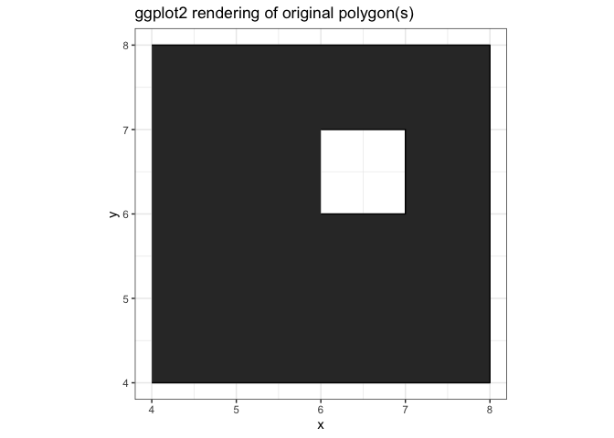
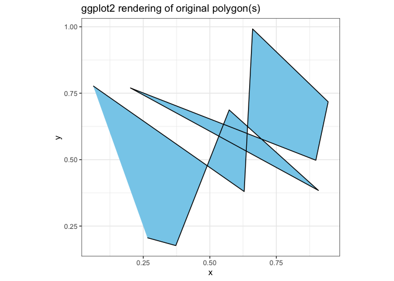
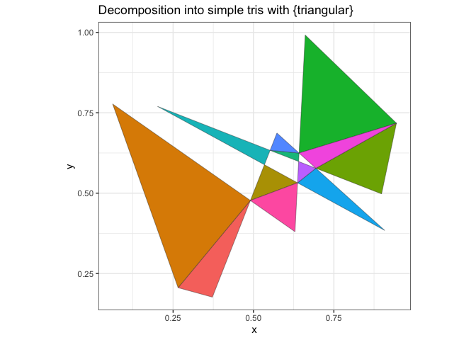
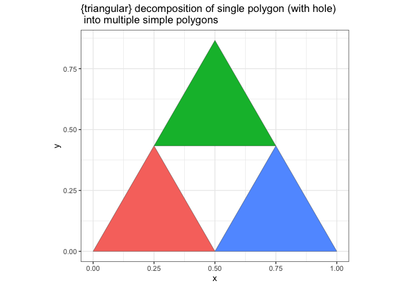

<!-- README.md is generated from README.Rmd. Please edit that file -->

# triangular 

<!-- badges: start -->

 [](https://www.tidyverse.org/lifecycle/#experimental)
<!-- badges: end -->

`triangular` decomposes complex polygons into sets of triangles and
works with:

  - polygons with holes
  - self-intersecting polygons
  - polygons with duplicated vertices

## Licensing

While the code in this package is licensed under
[MIT](https://mit-license.org/), this package relies heavily on:

  - [RTriangle](https://cran.r-project.org/package=RTriangle) which is
    licensed [CC
    BY-NC-SA 4.0](https://creativecommons.org/licenses/by-nc-sa/4.0).
  - [polyclip](https://cran.r-project.org/package=polyclip) which is
    licensed under [BSL](https://www.boost.org/LICENSE_1_0.txt)

## Installation

You can install from
[GitHub](https://github.com/coolbutuseless/triangular) with:

``` r
# install.package('remotes')
remotes::install_github('coolbutuseless/triangular')
```

## Polygon with a Hole in it

#### `ggplot2` rendering of polygon with a hole in it

``` r
#~~~~~~~~~~~~~~~~~~~~~~~~~~~~~~~~~~~~~~~~~~~~~~~~~~~~~~~~~~~~~~~~~~~~~~~~~~~~~
# polygons_df - data.frame of polygon vertices with group/subgroups
#~~~~~~~~~~~~~~~~~~~~~~~~~~~~~~~~~~~~~~~~~~~~~~~~~~~~~~~~~~~~~~~~~~~~~~~~~~~~~
polygons_df <- df <- data.frame(
  x        = c(4, 8, 8, 4,   6, 7, 7, 6),
  y        = c(4, 4, 8, 8,   6, 6, 7, 7),
  group    = c(1, 1, 1, 1,   1, 1, 1, 1),
  subgroup = c(1, 1, 1, 1,   2, 2, 2, 2)
)

#~~~~~~~~~~~~~~~~~~~~~~~~~~~~~~~~~~~~~~~~~~~~~~~~~~~~~~~~~~~~~~~~~~~~~~~~~~~~~
# How 'ggplot2' handles this case
#~~~~~~~~~~~~~~~~~~~~~~~~~~~~~~~~~~~~~~~~~~~~~~~~~~~~~~~~~~~~~~~~~~~~~~~~~~~~~
ggplot(polygons_df) +
  geom_polygon(aes(x, y, group=group, subgroup=subgroup)) +
  geom_path(aes(x, y, group = interaction(group, subgroup))) +
  theme_bw() + 
  coord_equal() + 
  labs(title = "ggplot2 rendering of original polygon(s)")
```



#### `{triangular}` decomposition of a polygon with a hole

``` r
#~~~~~~~~~~~~~~~~~~~~~~~~~~~~~~~~~~~~~~~~~~~~~~~~~~~~~~~~~~~~~~~~~~~~~~~~~~~~~
# Turn the polygon data.frame into individual triangles
#~~~~~~~~~~~~~~~~~~~~~~~~~~~~~~~~~~~~~~~~~~~~~~~~~~~~~~~~~~~~~~~~~~~~~~~~~~~~~
triangles_df <- triangular::decompose(polygons_df)

#~~~~~~~~~~~~~~~~~~~~~~~~~~~~~~~~~~~~~~~~~~~~~~~~~~~~~~~~~~~~~~~~~~~~~~~~~~~~~
# Plot the triangles
#~~~~~~~~~~~~~~~~~~~~~~~~~~~~~~~~~~~~~~~~~~~~~~~~~~~~~~~~~~~~~~~~~~~~~~~~~~~~~
ggplot(triangles_df) +
  geom_polygon(aes(x, y, fill = as.factor(idx)), colour = 'grey20', size = 0.15) +
  theme_bw() + 
  coord_equal() + 
  labs(title = "Decomposition into simple tris with {triangular}") + 
  theme(legend.position = 'none') 
```


## Polygon with Two Holes

#### `ggplot2` rendering of polygon with two holes

``` r
#~~~~~~~~~~~~~~~~~~~~~~~~~~~~~~~~~~~~~~~~~~~~~~~~~~~~~~~~~~~~~~~~~~~~~~~~~~~~~
# polygon
#~~~~~~~~~~~~~~~~~~~~~~~~~~~~~~~~~~~~~~~~~~~~~~~~~~~~~~~~~~~~~~~~~~~~~~~~~~~~~
polygons_df <- data.frame(
  x        = c(4, 8, 8, 4,   6, 7, 7, 6,  4.5,   5, 5, 4.5),
  y        = c(4, 4, 8, 8,   6, 6, 7, 7,  4.5, 4.5, 5, 5),
  group    = c(1, 1, 1, 1,   1, 1, 1, 1,    1,   1, 1, 1),
  subgroup = c(1, 1, 1, 1,   2, 2, 2, 2,    3,   3, 3, 3)
)

#~~~~~~~~~~~~~~~~~~~~~~~~~~~~~~~~~~~~~~~~~~~~~~~~~~~~~~~~~~~~~~~~~~~~~~~~~~~~~
# "Native" ggplot2 rendering
#~~~~~~~~~~~~~~~~~~~~~~~~~~~~~~~~~~~~~~~~~~~~~~~~~~~~~~~~~~~~~~~~~~~~~~~~~~~~~
ggplot(polygons_df) +
  geom_polygon(aes(x, y, subgroup = subgroup)) + 
  theme_bw() + 
  coord_equal() + 
  labs(title = "ggplot2 rendering of original polygon(s)")
```


#### `{triangular}` decomposition of a polygon with two holes

``` r
#~~~~~~~~~~~~~~~~~~~~~~~~~~~~~~~~~~~~~~~~~~~~~~~~~~~~~~~~~~~~~~~~~~~~~~~~~~~~~
# Decompose into triangles
#~~~~~~~~~~~~~~~~~~~~~~~~~~~~~~~~~~~~~~~~~~~~~~~~~~~~~~~~~~~~~~~~~~~~~~~~~~~~~
triangles_df <- triangular::decompose(polygons_df)

#~~~~~~~~~~~~~~~~~~~~~~~~~~~~~~~~~~~~~~~~~~~~~~~~~~~~~~~~~~~~~~~~~~~~~~~~~~~~~
# Plot the `triangular` decomposition into triangles
#~~~~~~~~~~~~~~~~~~~~~~~~~~~~~~~~~~~~~~~~~~~~~~~~~~~~~~~~~~~~~~~~~~~~~~~~~~~~~
ggplot(triangles_df) +
  geom_polygon(aes(x, y, fill = as.factor(idx)), colour = 'grey20', size = 0.15) +
  theme_bw() + 
  coord_equal() + 
  labs(title = "Decomposition into simple tris with {triangular}") + 
  theme(legend.position = 'none') 
```


## Two Polygons with One Hole Each

#### `ggplot2` rendering of muliple polygons with holes

``` r
#~~~~~~~~~~~~~~~~~~~~~~~~~~~~~~~~~~~~~~~~~~~~~~~~~~~~~~~~~~~~~~~~~~~~~~~~~~~~~
# Two polygons with one hole each
#~~~~~~~~~~~~~~~~~~~~~~~~~~~~~~~~~~~~~~~~~~~~~~~~~~~~~~~~~~~~~~~~~~~~~~~~~~~~~
polygons_df <- data.frame(
  x        = c(1, 4, 4, 1,  2, 3, 3, 2,      5, 8, 8, 5,  6, 7, 7, 6),
  y        = c(1, 1, 4, 4,  2, 2, 3, 3,      5, 5, 8, 8,  6, 6, 7, 7),
  group    = c(1, 1, 1, 1,  1, 1, 1, 1,      2, 2, 2, 2,  2, 2, 2, 2),
  subgroup = c(1, 1, 1, 1,  2, 2, 2, 2,      3, 3, 3, 3,  4, 4, 4, 4),
  fill     = rep(c('tomato', 'skyblue'), each = 8)
)

#~~~~~~~~~~~~~~~~~~~~~~~~~~~~~~~~~~~~~~~~~~~~~~~~~~~~~~~~~~~~~~~~~~~~~~~~~~~~~
# "Native" ggplot2 rendering
#~~~~~~~~~~~~~~~~~~~~~~~~~~~~~~~~~~~~~~~~~~~~~~~~~~~~~~~~~~~~~~~~~~~~~~~~~~~~~
ggplot(polygons_df) +
  geom_polygon(aes(x, y, subgroup = subgroup, fill = I(fill))) + 
  theme_bw() + 
  coord_equal() + 
  labs(title = "ggplot2 rendering of original polygon(s)")
```


#### triangular decomposition (Two Polygons with One Hole Each)

``` r
#~~~~~~~~~~~~~~~~~~~~~~~~~~~~~~~~~~~~~~~~~~~~~~~~~~~~~~~~~~~~~~~~~~~~~~~~~~~~~
# Decompose into triangles
#~~~~~~~~~~~~~~~~~~~~~~~~~~~~~~~~~~~~~~~~~~~~~~~~~~~~~~~~~~~~~~~~~~~~~~~~~~~~~
triangles_df <- triangular::decompose(polygons_df)

#~~~~~~~~~~~~~~~~~~~~~~~~~~~~~~~~~~~~~~~~~~~~~~~~~~~~~~~~~~~~~~~~~~~~~~~~~~~~~
# Plot the `triangular` decomposition into triangles
#~~~~~~~~~~~~~~~~~~~~~~~~~~~~~~~~~~~~~~~~~~~~~~~~~~~~~~~~~~~~~~~~~~~~~~~~~~~~~
ggplot(triangles_df) +
  geom_polygon(aes(x, y, fill = I(fill), group = idx), colour = 'grey20', size = 0.15) +
  theme_bw() +
  coord_equal() + 
  labs(title = "Decomposition into simple tris with {triangular}") + 
  theme(legend.position = 'none') 
```


## Polygon with duplicated vertex

This happens sometimes with `ggplot2::geom_density()`

#### `ggplot2` rendering of polygon with duplicated vertices

``` r
#~~~~~~~~~~~~~~~~~~~~~~~~~~~~~~~~~~~~~~~~~~~~~~~~~~~~~~~~~~~~~~~~~~~~~~~~~~~~~
# Polygon with duplicated vertex
#~~~~~~~~~~~~~~~~~~~~~~~~~~~~~~~~~~~~~~~~~~~~~~~~~~~~~~~~~~~~~~~~~~~~~~~~~~~~~
polygons_df <- data.frame(
  x        = c(1, 2, 2, 1,  2, 3, 3, 2),
  y        = c(1, 1, 2, 2,  2, 2, 3, 3),
  group    = c(1, 1, 1, 1,  2, 2, 2, 2),
  subgroup = 1,
  fill     = rep(c('tomato', 'skyblue'), each = 4)
)


#~~~~~~~~~~~~~~~~~~~~~~~~~~~~~~~~~~~~~~~~~~~~~~~~~~~~~~~~~~~~~~~~~~~~~~~~~~~~~
# "Native" ggplot2 rendering
#~~~~~~~~~~~~~~~~~~~~~~~~~~~~~~~~~~~~~~~~~~~~~~~~~~~~~~~~~~~~~~~~~~~~~~~~~~~~~
ggplot(polygons_df) +
  geom_polygon(aes(x, y, group = group, fill = I(fill))) +
  theme_bw() + 
  coord_equal() + 
  labs(title = "ggplot2 rendering of original polygon(s)")
```


#### `triangular` decomposition - (Polygon with duplicated vertex)

``` r
#~~~~~~~~~~~~~~~~~~~~~~~~~~~~~~~~~~~~~~~~~~~~~~~~~~~~~~~~~~~~~~~~~~~~~~~~~~~~~
# Decompose into triangles
#~~~~~~~~~~~~~~~~~~~~~~~~~~~~~~~~~~~~~~~~~~~~~~~~~~~~~~~~~~~~~~~~~~~~~~~~~~~~~
triangles_df <- triangular::decompose(polygons_df)

#~~~~~~~~~~~~~~~~~~~~~~~~~~~~~~~~~~~~~~~~~~~~~~~~~~~~~~~~~~~~~~~~~~~~~~~~~~~~~
# Plot the `triangular` decomposition into triangles
#~~~~~~~~~~~~~~~~~~~~~~~~~~~~~~~~~~~~~~~~~~~~~~~~~~~~~~~~~~~~~~~~~~~~~~~~~~~~~
ggplot(triangles_df) +
  geom_polygon(aes(x, y, fill = I(fill), group = idx), colour = 'grey20', size = 0.15) +
  theme_bw() + 
  coord_equal() + 
  labs(title = "Decomposition into simple tris with {triangular}") +
  theme(legend.position = 'none') 
```


## Polygon from Random Points

#### `ggplot2` rendering of a Polygon made from Random Points)

``` r
#~~~~~~~~~~~~~~~~~~~~~~~~~~~~~~~~~~~~~~~~~~~~~~~~~~~~~~~~~~~~~~~~~~~~~~~~~~~~~
# 10 random points
#~~~~~~~~~~~~~~~~~~~~~~~~~~~~~~~~~~~~~~~~~~~~~~~~~~~~~~~~~~~~~~~~~~~~~~~~~~~~~
set.seed(1)
polygons_df <- data.frame(
  x        = runif(10),
  y        = runif(10),
  group    = 1,
  subgroup = 1
)

#~~~~~~~~~~~~~~~~~~~~~~~~~~~~~~~~~~~~~~~~~~~~~~~~~~~~~~~~~~~~~~~~~~~~~~~~~~~~~
# "Native" ggplot2 rendering
#~~~~~~~~~~~~~~~~~~~~~~~~~~~~~~~~~~~~~~~~~~~~~~~~~~~~~~~~~~~~~~~~~~~~~~~~~~~~~
ggplot(polygons_df) +
  geom_polygon(aes(x, y), fill = 'skyblue') +
  geom_path(aes(x, y, group = interaction(group, subgroup))) +
  theme_bw() + 
  coord_equal() + 
  labs(title = "ggplot2 rendering of original polygon(s)")
```



#### `triangular` decomposition - (Polygon from Random Points)

``` r
#~~~~~~~~~~~~~~~~~~~~~~~~~~~~~~~~~~~~~~~~~~~~~~~~~~~~~~~~~~~~~~~~~~~~~~~~~~~~~
# Decompose into triangles
#~~~~~~~~~~~~~~~~~~~~~~~~~~~~~~~~~~~~~~~~~~~~~~~~~~~~~~~~~~~~~~~~~~~~~~~~~~~~~
triangles_df <- triangular::decompose(polygons_df)

#~~~~~~~~~~~~~~~~~~~~~~~~~~~~~~~~~~~~~~~~~~~~~~~~~~~~~~~~~~~~~~~~~~~~~~~~~~~~~
# Plot the `triangular` decomposition into triangles
#~~~~~~~~~~~~~~~~~~~~~~~~~~~~~~~~~~~~~~~~~~~~~~~~~~~~~~~~~~~~~~~~~~~~~~~~~~~~~
ggplot(triangles_df) +
  geom_polygon(aes(x, y, fill = as.factor(idx)), colour = 'grey20', size = 0.15) +
  theme_bw() + 
  coord_equal() + 
  labs(title = "Decomposition into simple tris with {triangular}") + 
  theme(legend.position = 'none') 
```



## Triforce

## Triforce

``` r
d <- sqrt(3)/2

#~~~~~~~~~~~~~~~~~~~~~~~~~~~~~~~~~~~~~~~~~~~~~~~~~~~~~~~~~~~~~~~~~~~~~~~~~~~~~
# Single triangle with a triangular hole
#~~~~~~~~~~~~~~~~~~~~~~~~~~~~~~~~~~~~~~~~~~~~~~~~~~~~~~~~~~~~~~~~~~~~~~~~~~~~~
polygons_df <- df <- data.frame(
  x        = c(0, 1, 0.5,   0.25, 0.5, 0.75),
  y        = c(0, 0, d  ,   d/2 , 0  ,  d/2),
  subgroup = c(1, 1, 1  ,      2,   2,    2),
  group    = 1L
)

#~~~~~~~~~~~~~~~~~~~~~~~~~~~~~~~~~~~~~~~~~~~~~~~~~~~~~~~~~~~~~~~~~~~~~~~~~~~~~
# "Native" ggplot2 rendering
#~~~~~~~~~~~~~~~~~~~~~~~~~~~~~~~~~~~~~~~~~~~~~~~~~~~~~~~~~~~~~~~~~~~~~~~~~~~~~
ggplot(polygons_df) +
  geom_polygon(aes(x, y, subgroup = subgroup)) +
  geom_path(aes(x, y, group = interaction(group, subgroup))) +
  theme_bw() + 
  coord_equal() + 
  labs(title = "ggplot2 rendering of original polygon")
```


``` r
#~~~~~~~~~~~~~~~~~~~~~~~~~~~~~~~~~~~~~~~~~~~~~~~~~~~~~~~~~~~~~~~~~~~~~~~~~~~~~
# decompose into simple triangular pieces i.e. without holes or self-intersections
#~~~~~~~~~~~~~~~~~~~~~~~~~~~~~~~~~~~~~~~~~~~~~~~~~~~~~~~~~~~~~~~~~~~~~~~~~~~~~
triangles_df <- triangular::decompose(polygons_df)

#~~~~~~~~~~~~~~~~~~~~~~~~~~~~~~~~~~~~~~~~~~~~~~~~~~~~~~~~~~~~~~~~~~~~~~~~~~~~~
# Plot the decomposition into triangles
#~~~~~~~~~~~~~~~~~~~~~~~~~~~~~~~~~~~~~~~~~~~~~~~~~~~~~~~~~~~~~~~~~~~~~~~~~~~~~
ggplot(triangles_df) +
  geom_polygon(aes(x, y, fill = as.factor(idx)), colour = 'grey20', size = 0.15) +
  theme_bw() + 
  coord_equal() + 
  labs(title = "{triangular} decomposition of single polygon (with hole)\n into multiple simple polygons") + 
  theme(legend.position = 'none') 
```



## Logo

#### `ggplot2` rendering nested hexagons

``` r
#~~~~~~~~~~~~~~~~~~~~~~~~~~~~~~~~~~~~~~~~~~~~~~~~~~~~~~~~~~~~~~~~~~~~~~~~~~~~~
# polygons_df - data.frame of polygon vertices with group/subgroups
#~~~~~~~~~~~~~~~~~~~~~~~~~~~~~~~~~~~~~~~~~~~~~~~~~~~~~~~~~~~~~~~~~~~~~~~~~~~~~
r <- 5
hex_df <- data.frame(
  x = r * cos(seq(30, 360, 60) * pi/180),
  y = r * sin(seq(30, 360, 60) * pi/180),
  group = 1,
  subgroup = 1
)

hole_df <- data.frame(
  x = 2 * cos(seq(30, 360, 60) * pi/180) + 1,
  y = 2 * sin(seq(30, 360, 60) * pi/180) + 1,
  group    = 1,
  subgroup = 2
)

polygons_df <- rbind(hex_df, hole_df)


#~~~~~~~~~~~~~~~~~~~~~~~~~~~~~~~~~~~~~~~~~~~~~~~~~~~~~~~~~~~~~~~~~~~~~~~~~~~~~
# How 'ggplot2' handles this case
#~~~~~~~~~~~~~~~~~~~~~~~~~~~~~~~~~~~~~~~~~~~~~~~~~~~~~~~~~~~~~~~~~~~~~~~~~~~~~
ggplot(polygons_df) +
  geom_polygon(aes(x, y, group=group, subgroup=subgroup)) +
  geom_path(aes(x, y, group = interaction(group, subgroup))) +
  theme_bw() + 
  coord_equal() + 
  labs(title = "ggplot2 rendering of original polygon(s)")
```


#### `{triangular}` decomposition of nested hexagons

``` r
#~~~~~~~~~~~~~~~~~~~~~~~~~~~~~~~~~~~~~~~~~~~~~~~~~~~~~~~~~~~~~~~~~~~~~~~~~~~~~
# Turn the polygon data.frame into individual triangles
#~~~~~~~~~~~~~~~~~~~~~~~~~~~~~~~~~~~~~~~~~~~~~~~~~~~~~~~~~~~~~~~~~~~~~~~~~~~~~
triangles_df <- triangular::decompose(polygons_df)

#~~~~~~~~~~~~~~~~~~~~~~~~~~~~~~~~~~~~~~~~~~~~~~~~~~~~~~~~~~~~~~~~~~~~~~~~~~~~~
# Plot the triangles
#~~~~~~~~~~~~~~~~~~~~~~~~~~~~~~~~~~~~~~~~~~~~~~~~~~~~~~~~~~~~~~~~~~~~~~~~~~~~~
p <- ggplot(triangles_df) +
  geom_polygon(aes(x, y, fill = as.factor(idx)), colour = 'grey20', size = 0.15) +
  theme_void() + 
  coord_equal() + 
  theme(legend.position = 'none') + 
  scale_fill_viridis_d(option = 'D') + 
  annotate('text', x = 1, y = 1.4, label = 't\nr  i\na  n  g\nu  l  a  r', 
           size = 5.5, family = 'mono', fontface = 'bold')

ggsave("man/figures/logo.png", plot = p, width = 5, height = 5)

p
```


## Related Software

  - [silicate](https://cran.r-project.org/package=silicate) +
    [anglr](https://cran.r-project.org/package=anglr) do all of what
    triangular does (and more\!), with a much more configurable
    interface (that I did not need)
  - [decido](https://cran.r-project.org/package=decido) does fast
    ear-cutting triangulation.  
    Unfortunately, this doesn’t deal nicely with self-intersecting
    polygons.

## Acknowledgements

  - [Michael Sumner](https://twitter.com/mdsumner) on twitter for his
    in-depth technical advice on graphics and and triangles in R
  - R Core for developing and maintaining such a wonderful language.
  - CRAN maintainers, for patiently shepherding packages onto CRAN and
    maintaining the repository
