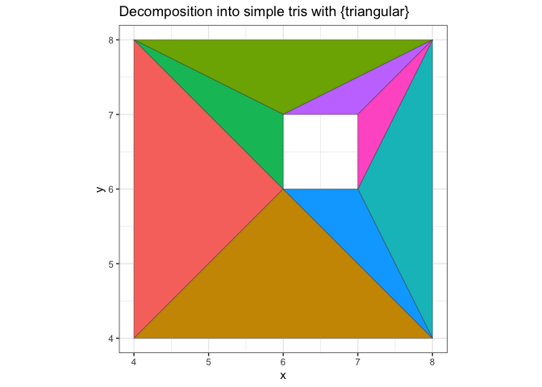
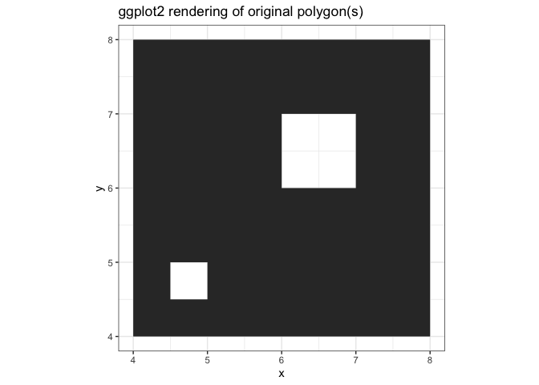
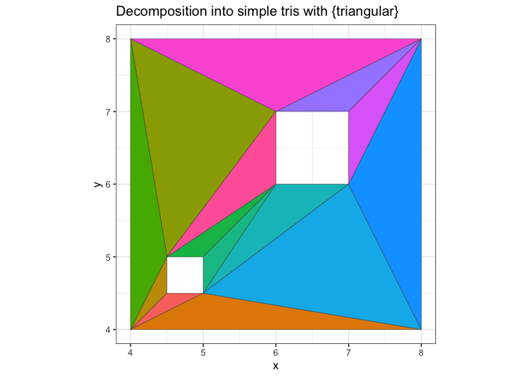
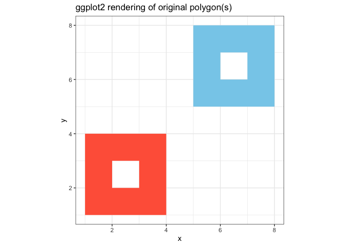
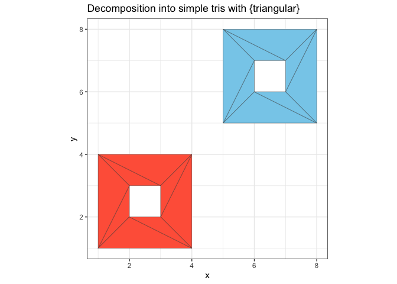
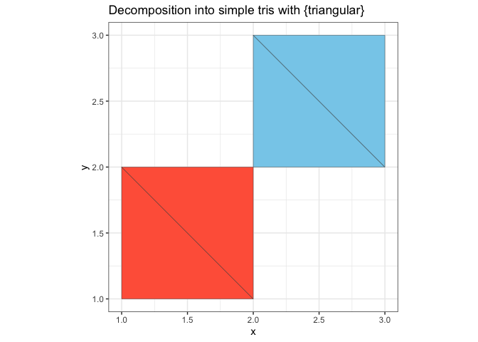

<!-- README.md is generated from README.Rmd. Please edit that file -->

# triangular

<!-- badges: start -->

 [](https://www.tidyverse.org/lifecycle/#experimental)
<!-- badges: end -->

`triangular` decomposes complex polygons into sets of triangles and
works with:

  - polygons with holes
  - self-intersecting polygons
  - polygons with duplicated vertices

## Overview of process

  - Split the given data.frame of polygons by `group` and `subgroup`
  - Use `polyclip::polysimplify()` to simplify polygons i.e.
      - remove duplicated vertices
      - break self-intersecting polygons into simpler polygons
  - massage the data into a format suitable for `RTriangle::pslg()` and
    use this function to create a *Planar Straight Line Graph object*.
  - Triangulate this object with `RTriangle::triangulate()` which
    triangulates the simple polygons, while also taking into account the
    presence of holes in the polygons

## Licensing

While the code in this package is licensed under
[MIT](https://mit-license.org/), this package relies heavily on:

  - [RTriangle](https://cran.r-project.org/package=RTriangle) which is
    licensed [CC
    BY-NC-SA 4.0](https://creativecommons.org/licenses/by-nc-sa/4.0).
  - [polyclip](https://cran.r-project.org/package=polyclip) which is
    licensed [BSL](https://www.boost.org/LICENSE_1_0.txt)

## Installation

You can install from
[GitHub](https://github.com/coolbutuseless/triangular) with:

``` r
# install.package('remotes')
remotes::install_github('coolbutuseless/triangular')
```

## Example

This is a basic example which shows you how to solve a common problem:

``` r
library(triangular)
```

## Polygon with a Hole in it

#### ggplot

``` r
#~~~~~~~~~~~~~~~~~~~~~~~~~~~~~~~~~~~~~~~~~~~~~~~~~~~~~~~~~~~~~~~~~~~~~~~~~~~~~
# polygons_df - data.frame of polygon vertices with group/subgroups
#~~~~~~~~~~~~~~~~~~~~~~~~~~~~~~~~~~~~~~~~~~~~~~~~~~~~~~~~~~~~~~~~~~~~~~~~~~~~~
polygons_df <- df <- data.frame(
  x        = c(4, 8, 8, 4,   6, 7, 7, 6),
  y        = c(4, 4, 8, 8,   6, 6, 7, 7),
  group    = c(1, 1, 1, 1,   1, 1, 1, 1),
  subgroup = c(1, 1, 1, 1,   2, 2, 2, 2)
)

#~~~~~~~~~~~~~~~~~~~~~~~~~~~~~~~~~~~~~~~~~~~~~~~~~~~~~~~~~~~~~~~~~~~~~~~~~~~~~
# How 'ggplot2' handles this case
#~~~~~~~~~~~~~~~~~~~~~~~~~~~~~~~~~~~~~~~~~~~~~~~~~~~~~~~~~~~~~~~~~~~~~~~~~~~~~
ggplot(polygons_df) +
  geom_polygon(aes(x, y, group=group, subgroup=subgroup)) +
  geom_path(aes(x, y, group = interaction(group, subgroup)), colour = 'red') +
  theme_bw() + 
  coord_equal() + 
  labs(title = "ggplot2 rendering of original polygon(s)")
```


#### `{triangular}`

``` r
#~~~~~~~~~~~~~~~~~~~~~~~~~~~~~~~~~~~~~~~~~~~~~~~~~~~~~~~~~~~~~~~~~~~~~~~~~~~~~
# Turn the polygon data.frame into individual triangles
#~~~~~~~~~~~~~~~~~~~~~~~~~~~~~~~~~~~~~~~~~~~~~~~~~~~~~~~~~~~~~~~~~~~~~~~~~~~~~
res <- triangular::decompose(polygons_df)

#~~~~~~~~~~~~~~~~~~~~~~~~~~~~~~~~~~~~~~~~~~~~~~~~~~~~~~~~~~~~~~~~~~~~~~~~~~~~~
# Remove the triangles which are 'interior' according to the even-odd rule
#~~~~~~~~~~~~~~~~~~~~~~~~~~~~~~~~~~~~~~~~~~~~~~~~~~~~~~~~~~~~~~~~~~~~~~~~~~~~~
triangles_df <- res$triangles_df %>%
  filter(interior)

#~~~~~~~~~~~~~~~~~~~~~~~~~~~~~~~~~~~~~~~~~~~~~~~~~~~~~~~~~~~~~~~~~~~~~~~~~~~~~
# Plot the triangles
#~~~~~~~~~~~~~~~~~~~~~~~~~~~~~~~~~~~~~~~~~~~~~~~~~~~~~~~~~~~~~~~~~~~~~~~~~~~~~
ggplot(triangles_df) +
  geom_polygon(aes(x, y, group = idx), alpha = 0.3, colour = 'blue') +
  theme_bw() + 
  coord_equal() + 
  labs(title = "Decomposition into simple tris with {triangular}")
```



## Polygon with Two Holes

#### ggplot2

``` r
#~~~~~~~~~~~~~~~~~~~~~~~~~~~~~~~~~~~~~~~~~~~~~~~~~~~~~~~~~~~~~~~~~~~~~~~~~~~~~
# polygon
#~~~~~~~~~~~~~~~~~~~~~~~~~~~~~~~~~~~~~~~~~~~~~~~~~~~~~~~~~~~~~~~~~~~~~~~~~~~~~
polygons_df <- data.frame(
  x        = c(4, 8, 8, 4,   6, 7, 7, 6,  4.5,   5, 5, 4.5),
  y        = c(4, 4, 8, 8,   6, 6, 7, 7,  4.5, 4.5, 5, 5),
  group    = c(1, 1, 1, 1,   1, 1, 1, 1,    1,   1, 1, 1),
  subgroup = c(1, 1, 1, 1,   2, 2, 2, 2,    3,   3, 3, 3)
)

#~~~~~~~~~~~~~~~~~~~~~~~~~~~~~~~~~~~~~~~~~~~~~~~~~~~~~~~~~~~~~~~~~~~~~~~~~~~~~
# "Native" ggplot2 rendering
#~~~~~~~~~~~~~~~~~~~~~~~~~~~~~~~~~~~~~~~~~~~~~~~~~~~~~~~~~~~~~~~~~~~~~~~~~~~~~
ggplot(polygons_df) +
  geom_polygon(aes(x, y, subgroup = subgroup), colour = 'red') + 
  theme_bw() + 
  coord_equal() + 
  labs(title = "ggplot2 rendering of original polygon(s)")
```



#### `{triangular}`

``` r
#~~~~~~~~~~~~~~~~~~~~~~~~~~~~~~~~~~~~~~~~~~~~~~~~~~~~~~~~~~~~~~~~~~~~~~~~~~~~~
# Decompose into triangles
#~~~~~~~~~~~~~~~~~~~~~~~~~~~~~~~~~~~~~~~~~~~~~~~~~~~~~~~~~~~~~~~~~~~~~~~~~~~~~
res <- triangular::decompose(polygons_df)

#~~~~~~~~~~~~~~~~~~~~~~~~~~~~~~~~~~~~~~~~~~~~~~~~~~~~~~~~~~~~~~~~~~~~~~~~~~~~~
# Remove the triangles which are 'interior' according to the even-odd rule
#~~~~~~~~~~~~~~~~~~~~~~~~~~~~~~~~~~~~~~~~~~~~~~~~~~~~~~~~~~~~~~~~~~~~~~~~~~~~~
triangles_df <- res$triangles_df %>%
  filter(interior)

#~~~~~~~~~~~~~~~~~~~~~~~~~~~~~~~~~~~~~~~~~~~~~~~~~~~~~~~~~~~~~~~~~~~~~~~~~~~~~
# Plot the `triangular` decomposition into triangles
#~~~~~~~~~~~~~~~~~~~~~~~~~~~~~~~~~~~~~~~~~~~~~~~~~~~~~~~~~~~~~~~~~~~~~~~~~~~~~
ggplot(triangles_df) +
  geom_polygon(aes(x, y, group = idx), alpha = 0.3, colour = 'blue') +
  theme_bw() + 
  coord_equal() + 
  labs(title = "Decomposition into simple tris with {triangular}")
```



## Two Polygons with One Hole Each

#### ggplot

``` r
#~~~~~~~~~~~~~~~~~~~~~~~~~~~~~~~~~~~~~~~~~~~~~~~~~~~~~~~~~~~~~~~~~~~~~~~~~~~~~
# Two polygons with one hole each
#~~~~~~~~~~~~~~~~~~~~~~~~~~~~~~~~~~~~~~~~~~~~~~~~~~~~~~~~~~~~~~~~~~~~~~~~~~~~~
polygons_df <- data.frame(
  x        = c(1, 4, 4, 1,  2, 3, 3, 2,      5, 8, 8, 5,  6, 7, 7, 6),
  y        = c(1, 1, 4, 4,  2, 2, 3, 3,      5, 5, 8, 8,  6, 6, 7, 7),
  group    = c(1, 1, 1, 1,  1, 1, 1, 1,      1, 1, 1, 1,  1, 1, 1, 1),
  subgroup = c(1, 1, 1, 1,  2, 2, 2, 2,      3, 3, 3, 3,  4, 4, 4, 4)
)

#~~~~~~~~~~~~~~~~~~~~~~~~~~~~~~~~~~~~~~~~~~~~~~~~~~~~~~~~~~~~~~~~~~~~~~~~~~~~~
# "Native" ggplot2 rendering
#~~~~~~~~~~~~~~~~~~~~~~~~~~~~~~~~~~~~~~~~~~~~~~~~~~~~~~~~~~~~~~~~~~~~~~~~~~~~~
ggplot(polygons_df) +
  geom_polygon(aes(x, y, subgroup = subgroup), colour = 'red') + 
  theme_bw() + 
  coord_equal() + 
  labs(title = "ggplot2 rendering of original polygon(s)")
```



#### triangular (Two Polygons with One Hole Each)

``` r
#~~~~~~~~~~~~~~~~~~~~~~~~~~~~~~~~~~~~~~~~~~~~~~~~~~~~~~~~~~~~~~~~~~~~~~~~~~~~~
# Decompose into triangles
#~~~~~~~~~~~~~~~~~~~~~~~~~~~~~~~~~~~~~~~~~~~~~~~~~~~~~~~~~~~~~~~~~~~~~~~~~~~~~
res <- triangular::decompose(polygons_df)

#~~~~~~~~~~~~~~~~~~~~~~~~~~~~~~~~~~~~~~~~~~~~~~~~~~~~~~~~~~~~~~~~~~~~~~~~~~~~~
# Remove the triangles which are 'interior' according to the even-odd rule
#~~~~~~~~~~~~~~~~~~~~~~~~~~~~~~~~~~~~~~~~~~~~~~~~~~~~~~~~~~~~~~~~~~~~~~~~~~~~~
triangles_df <- res$triangles_df %>%
  filter(interior)

#~~~~~~~~~~~~~~~~~~~~~~~~~~~~~~~~~~~~~~~~~~~~~~~~~~~~~~~~~~~~~~~~~~~~~~~~~~~~~
# Plot the `triangular` decomposition into triangles
#~~~~~~~~~~~~~~~~~~~~~~~~~~~~~~~~~~~~~~~~~~~~~~~~~~~~~~~~~~~~~~~~~~~~~~~~~~~~~
ggplot(triangles_df) +
  geom_polygon(aes(x, y, group = idx), alpha = 0.3, colour = 'blue') +
  theme_bw() +
  coord_equal() + 
  labs(title = "Decomposition into simple tris with {triangular}")
```



## Polygon with duplicated vertex

This happens sometimes with `ggplot2::geom_density()`

#### ggplot

``` r
#~~~~~~~~~~~~~~~~~~~~~~~~~~~~~~~~~~~~~~~~~~~~~~~~~~~~~~~~~~~~~~~~~~~~~~~~~~~~~
# Polygon with duplicated vertex
#~~~~~~~~~~~~~~~~~~~~~~~~~~~~~~~~~~~~~~~~~~~~~~~~~~~~~~~~~~~~~~~~~~~~~~~~~~~~~
polygons_df <- data.frame(
  x        = c(1, 2, 2, 1),
  y        = c(1, 1, 2, 2),
  group    = 1,
  subgroup = 1
)


#~~~~~~~~~~~~~~~~~~~~~~~~~~~~~~~~~~~~~~~~~~~~~~~~~~~~~~~~~~~~~~~~~~~~~~~~~~~~~
# Polygon with duplicated vertex
#~~~~~~~~~~~~~~~~~~~~~~~~~~~~~~~~~~~~~~~~~~~~~~~~~~~~~~~~~~~~~~~~~~~~~~~~~~~~~
polygons_df <- data.frame(
  x        = c(0, 1, 2, 2, 1, 1),
  y        = c(0, 1, 1, 2, 2, 1),
  group    = 1,
  subgroup = 1
)


#~~~~~~~~~~~~~~~~~~~~~~~~~~~~~~~~~~~~~~~~~~~~~~~~~~~~~~~~~~~~~~~~~~~~~~~~~~~~~
# "Native" ggplot2 rendering
#~~~~~~~~~~~~~~~~~~~~~~~~~~~~~~~~~~~~~~~~~~~~~~~~~~~~~~~~~~~~~~~~~~~~~~~~~~~~~
ggplot(polygons_df) +
  geom_polygon(aes(x, y)) +
  geom_path(aes(x, y, group = interaction(group, subgroup)), colour = 'red') +
  theme_bw() + 
  coord_equal() + 
  labs(title = "ggplot2 rendering of original polygon(s)") + 
  xlim(0, 2) + 
  ylim(0, 2)
```


#### triangular - (Polygon with duplicated vertex)

``` r
#~~~~~~~~~~~~~~~~~~~~~~~~~~~~~~~~~~~~~~~~~~~~~~~~~~~~~~~~~~~~~~~~~~~~~~~~~~~~~
# Decompose into triangles
#~~~~~~~~~~~~~~~~~~~~~~~~~~~~~~~~~~~~~~~~~~~~~~~~~~~~~~~~~~~~~~~~~~~~~~~~~~~~~
res <- triangular::decompose(polygons_df)

#~~~~~~~~~~~~~~~~~~~~~~~~~~~~~~~~~~~~~~~~~~~~~~~~~~~~~~~~~~~~~~~~~~~~~~~~~~~~~
# Remove the triangles which are 'interior' according to the even-odd rule
#~~~~~~~~~~~~~~~~~~~~~~~~~~~~~~~~~~~~~~~~~~~~~~~~~~~~~~~~~~~~~~~~~~~~~~~~~~~~~
triangles_df <- res$triangles_df %>%
  filter(interior)

#~~~~~~~~~~~~~~~~~~~~~~~~~~~~~~~~~~~~~~~~~~~~~~~~~~~~~~~~~~~~~~~~~~~~~~~~~~~~~
# Plot the `triangular` decomposition into triangles
#~~~~~~~~~~~~~~~~~~~~~~~~~~~~~~~~~~~~~~~~~~~~~~~~~~~~~~~~~~~~~~~~~~~~~~~~~~~~~
ggplot(triangles_df) +
  geom_polygon(aes(x, y, group = idx), alpha = 0.3, colour = 'blue') +
  theme_bw() + 
  coord_equal() + 
  labs(title = "Decomposition into simple tris with {triangular}") + 
  xlim(0, 2) + 
  ylim(0, 2)
```



## Polygon from Random Points

  - ggplot uses the underlying graphics engine to take care of polygon
    intersection etc
  - `{triangular}` uses `{RTriangle}` to break the input polygons into
    triangles.
  - `{polyclip}` separates the input polygons into simpler
    non-intersecting polygons, but does not necessarily decompose the
    inputs into triangles.

#### ggplot (Polygon from Random Points)

``` r
#~~~~~~~~~~~~~~~~~~~~~~~~~~~~~~~~~~~~~~~~~~~~~~~~~~~~~~~~~~~~~~~~~~~~~~~~~~~~~
# 10 random points
#~~~~~~~~~~~~~~~~~~~~~~~~~~~~~~~~~~~~~~~~~~~~~~~~~~~~~~~~~~~~~~~~~~~~~~~~~~~~~
set.seed(1)
polygons_df <- data.frame(
  x        = runif(10),
  y        = runif(10),
  group    = 1,
  subgroup = 1
)

#~~~~~~~~~~~~~~~~~~~~~~~~~~~~~~~~~~~~~~~~~~~~~~~~~~~~~~~~~~~~~~~~~~~~~~~~~~~~~
# "Native" ggplot2 rendering
#~~~~~~~~~~~~~~~~~~~~~~~~~~~~~~~~~~~~~~~~~~~~~~~~~~~~~~~~~~~~~~~~~~~~~~~~~~~~~
ggplot(polygons_df) +
  geom_polygon(aes(x, y)) +
  geom_path(aes(x, y, group = interaction(group, subgroup)), colour = 'red') +
  theme_bw() + 
  coord_equal() + 
  labs(title = "ggplot2 rendering of original polygon(s)")
```


#### triangular - (Polygon from Random Points)

``` r
#~~~~~~~~~~~~~~~~~~~~~~~~~~~~~~~~~~~~~~~~~~~~~~~~~~~~~~~~~~~~~~~~~~~~~~~~~~~~~
# Decompose into triangles
#~~~~~~~~~~~~~~~~~~~~~~~~~~~~~~~~~~~~~~~~~~~~~~~~~~~~~~~~~~~~~~~~~~~~~~~~~~~~~
res <- triangular::decompose(polygons_df)

#~~~~~~~~~~~~~~~~~~~~~~~~~~~~~~~~~~~~~~~~~~~~~~~~~~~~~~~~~~~~~~~~~~~~~~~~~~~~~
# Remove the triangles which are 'interior' according to the even-odd rule
#~~~~~~~~~~~~~~~~~~~~~~~~~~~~~~~~~~~~~~~~~~~~~~~~~~~~~~~~~~~~~~~~~~~~~~~~~~~~~
triangles_df <- res$triangles_df %>%
  filter(interior)

#~~~~~~~~~~~~~~~~~~~~~~~~~~~~~~~~~~~~~~~~~~~~~~~~~~~~~~~~~~~~~~~~~~~~~~~~~~~~~
# Plot the `triangular` decomposition into triangles
#~~~~~~~~~~~~~~~~~~~~~~~~~~~~~~~~~~~~~~~~~~~~~~~~~~~~~~~~~~~~~~~~~~~~~~~~~~~~~
ggplot(triangles_df) +
  geom_polygon(aes(x, y, group = idx), alpha = 0.3, colour = 'blue') +
  theme_bw() + 
  coord_equal() + 
  labs(title = "Decomposition into simple tris with {triangular}")
```


#### polyclip - Polygon from Random Points

``` r
#~~~~~~~~~~~~~~~~~~~~~~~~~~~~~~~~~~~~~~~~~~~~~~~~~~~~~~~~~~~~~~~~~~~~~~~~~~~~~
# Polyclip processing
#~~~~~~~~~~~~~~~~~~~~~~~~~~~~~~~~~~~~~~~~~~~~~~~~~~~~~~~~~~~~~~~~~~~~~~~~~~~~~
A <- split(polygons_df, interaction(polygons_df$group, polygons_df$subgroup))
simplified_list <- polyclip::polysimplify(A)

simplified_df <- lapply(
  seq_along(simplified_list),
  function(idx) {
    res <- as.data.frame(simplified_list[[idx]])
    res$idx <- idx
    res
  }
)
simplified_df <- do.call(rbind, simplified_df)

#~~~~~~~~~~~~~~~~~~~~~~~~~~~~~~~~~~~~~~~~~~~~~~~~~~~~~~~~~~~~~~~~~~~~~~~~~~~~~
# Plot the `polyclip` decomposition into triangles
#~~~~~~~~~~~~~~~~~~~~~~~~~~~~~~~~~~~~~~~~~~~~~~~~~~~~~~~~~~~~~~~~~~~~~~~~~~~~~
ggplot(simplified_df) +
  geom_polygon(aes(x, y, group = idx), alpha = 0.3, colour = 'blue') +
  theme_bw() + 
  coord_equal() + 
  labs(title = "Decomposition into simple polygons - 'polyclip::polysimplify()'")
```


